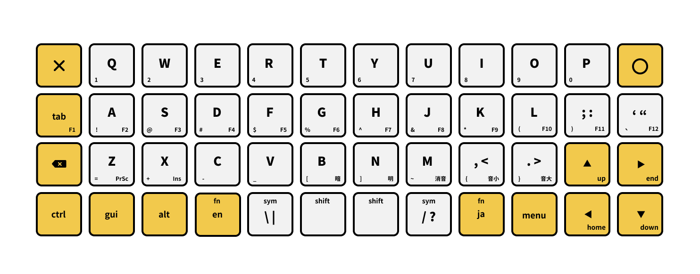
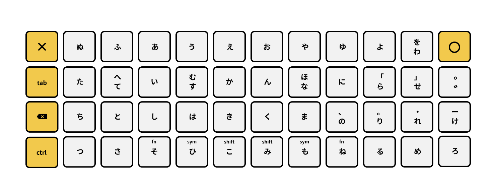

# Windmill
Windmill is a keymap for 40% keyboards.

このキー配列は、40%キーボード向けに作成したものです。

- 風車状のカーソル配置
- かな入力対応 (ほぼJISかな配列)
- SandS (Space and Shift)
- [Boardsource Technik](https://boardsource.xyz/store/5ffb9b01edd0447f8023fdb2)用の[ファームウェア](https://github.com/cognitom/windmill/releases)作成済み

詳しくは、以下をどうぞ。

- [キー配列 (↓)](#キー配列)
- [追加機能 (↓)](#追加機能)
- [導入方法](docs/install.md)
- [ファームウェアの作成](docs/build.md)
- [キーマップで使える機能](docs/keymap.md)

## キー配列

### 英字入力時

- ESC(✕)とEnter(○)が対称配置
- BSが最左列
- Fn, Sym, Shiftは、ホールド時に有効

### かな入力時

- 英語配列では修飾キーが並ぶ最下段も含めて、フルに4段を使う
- 「ほ」「へ」「む」「ー」のみシフト側へ
- 「こ」「み」同時押しでスペースキー
- GUI, Alt, Fn, Sym, Shiftは、ホールド時に有効 [※補足](docs/README.md#altguiは修飾キーかつ単打である問題)

### 記号とファンクションキー

英字入力、かな入力ともに、最下段中央付近のキーをホールドすると、記号(Sym)またはファンクションキー(Fn)の入力になります。配置については英字配列の図で、各キーの添え字を参照。

|  | L5 | L4| L3 | L2 | L1 | L0 | R0 | R1 | R2 |
|--|:--:|:--:|:--:|:--:|:--:|:--:|:--:|:--:|:--:|
| ホールド | Ctrl | GUI | Alt | Fn | Sym | Shift | Shift | Sym | Fn |
| タップ (英数) | 英数 | GUI | Alt | Num | \ | Space | Space | / | かな |
| タップ (かな) | 英数 | つ | さ | そ | ひ | こ | み | も | ね |

## 追加機能

### ダークモード

デフォルトの状態はLEDが明るいので、暗い部屋で使う場合に光量を落として使えるダークモードを用意しています。使い方は、次の通り。

- <kbd>Fn</kbd> + <kbd>Enter</kbd> を押す

ダークモードを解除するには、もう一度上記のキーを押します。

### 対象OSの切り替え

各OSのIMEの差異を吸収するため、モードを切り替えることができます。

| 独自キーコード | キー | 対象OS | 配列の認識 | IME |
|--|--|--|--|--|
| IME_WIN | <kbd>Fn</kbd>+<kbd>Q</kbd> | Windows 11 | English (US) | Microsof IME |
| IME_AND | <kbd>Fn</kbd>+<kbd>W</kbd> | Android | English (US) | Wnn Keyboard Lab |
| IME_CRM | <kbd>Fn</kbd>+<kbd>E</kbd> | Chrome OS | -- | Japanese with US keyboard |

※Android, Chrome OSでは、英数キー・かなキーがどちらもトグルになっています。

※Androidでは「ょ」(拗音)の入力ができません。後述のローマ字かなエミュレーションモードとの併用がオススメです。

### 入力モードの切り替え

Windmill は「かな入力」のために設計されましたが、ローマ字入力にも対応しています。

| 独自キーコード | キー | 入力モード | IME設定 |
|--|--|--|--|
| JA_ROME | <kbd>Fn</kbd>+<kbd>I</kbd> | ローマ字 | ローマ字入力 |
| JA_ROKA | <kbd>Fn</kbd>+<kbd>O</kbd> | ローマ字かなエミュレーション | ローマ字入力 |
| JA_KANE | <kbd>Fn</kbd>+<kbd>P</kbd> | かな | かな入力 |

### ローマ字かなエミュレーション

ローマ字かなエミュレーション入力は、かな入力機能がないOSでも、かな打ちを実現するための機能です。例えば、「た」のキーを打つと自動的にアルファベット2文字(ta)が送出されます。

通常のキーボードの場合、AndroidだとWnn Keyboard Labなどをインストールしないと「かな入力」できません。エミュレーションを使えば標準設定のまま、追加ソフトのインストールも不要で、そのままかな入力が可能です。

ただ、Windowsの標準IMEなどとは相性が悪いようです。OS設定でかな入力が選択可能な場合はそちらを「かな」モードで使うのが無難です。
