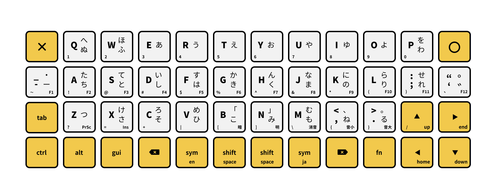
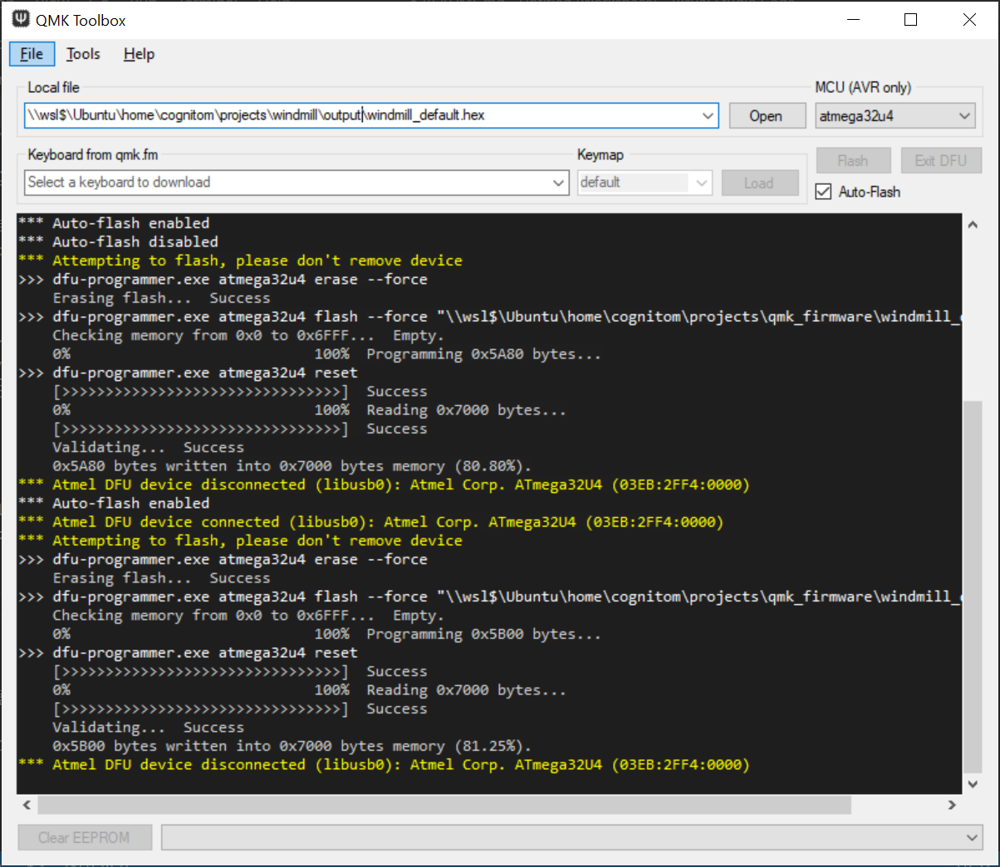

# Windmill
Windmill is a keymap for 40% keyboard.

このキー配列は、40%キーボード向けに作成したものです。

- 風車状のカーソル配置
- かな入力対応 (JISかな配列に近い)
- SandS (Space and Shift)
- [Boardsource Technik](https://boardsource.xyz/store/5ffb9b01edd0447f8023fdb2)用のファームウェア作成済み

※実機がなくてPlanck用はまだ作っていません。

## キー配列



## ファームウェアの作成

必要な環境は以下の通り。

- Windows(WSL2)、または Mac
- [QMK Toolbox](https://github.com/qmk/qmk_toolbox/releases)
- Docker

上記整っていれば、QMKのドキュメントにある[セットアップ手順](https://docs.qmk.fm/#/newbs_getting_started)は不要。このリポジトリをクローンして`build.sh`を実行すればOKです。

```bash
$ git clone https://github.com/cognitom/windmill.git
$ cd windmill
$ bash scripts/build.sh
```

`output`ディレクトリ内にファームウェアが作成されます。

1. QMK Toolboxから作成されたファイルを指定
2. キーボードを接続
3. キーボードのリセットボタンを爪楊枝などで押す
4. `Flash`実行



※なお、Macについては未検証なので、調整が必要かもしれません。

## かな入力

Google 日本語入力との併用で、かな入力が可能です。導入手順は[こちら](https://github.com/cognitom/sankaku/blob/master/getting-started.md#google-%E6%97%A5%E6%9C%AC%E8%AA%9E%E5%85%A5%E5%8A%9B-google-ime-japanese-%E3%81%AE%E3%82%A4%E3%83%B3%E3%82%B9%E3%83%88%E3%83%BC%E3%83%AB)と同様にすればOKです。

- 配列データ - [romantable-windmill.txt](https://raw.githubusercontent.com/cognitom/windmill/master/google-japanese-input/romantable-windmill.txt)
- キーマップ - [keymap-windmill.txt](https://raw.githubusercontent.com/cognitom/windmill/master/google-japanese-input/keymap-windmill.txt)
