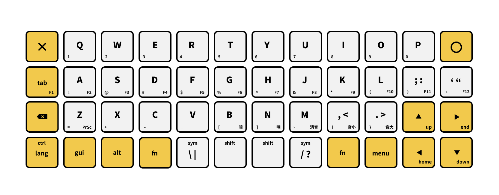
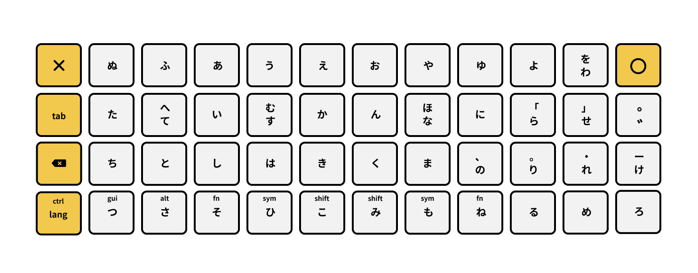

# Windmill
Windmill is a keymap for 40% keyboards.

このキー配列は、40%キーボード向けに作成したものです。

- 風車状のカーソル配置
- かな入力対応 (ほぼJISかな配列)
- SandS (Space and Shift)

詳しくは、以下をどうぞ。

- [キー配列 (↓)](#キー配列)
- [追加機能 (↓)](#追加機能)
- [導入方法](docs/install.md)
- [ファームウェアの作成](docs/build.md)

## 対応キーボード

- [Boardsource Technik](https://boardsource.xyz/store/5ffb9b01edd0447f8023fdb2)
- [YMD40](https://ymdkey.com/collections/40-mini-diy)

ファームウェアのバイナリは[リリースページ](https://github.com/cognitom/windmill/releases)からダウンロードできます。

## キー配列

### 英字入力時

- ESC(✕)とEnter(○)が対称配置
- BSが最左列
- Fn, Sym, Shiftは、ホールド時に有効

### かな入力時

- 英語配列では修飾キーが並ぶ最下段も含めて、フルに4段を使う
- 「ほ」「へ」「む」「ー」のみシフト側へ
- 「こ」「み」同時押しでスペースキー
- GUI, Alt, Fn, Sym, Shiftは、ホールド時に有効

### 記号とファンクションキー

英字入力、かな入力ともに、最下段中央付近のキーをホールドすると、記号(Sym)またはファンクションキー(Fn)の入力になります。配置については英字配列の図で、各キーの添え字を参照。

かな/英数切り替えは、Ctrlキーのタップ/ダブルタップで行います。

|  | L5 | L4| L3 | L2 | L1 | L0 | R0 | R1 | R2 |
|--|:--:|:--:|:--:|:--:|:--:|:--:|:--:|:--:|:--:|
| ホールド | Ctrl | GUI | Alt | Fn | Sym | Shift | Shift | Sym | Fn |
| タップ (英数) | 英数 | GUI | Alt | | \ | Space | Space | / | |
| タップ (かな) | 英数 | つ | さ | そ | ひ | こ | み | も | ね |
| ダブルタップ | かな | | | | | | | | |

## 追加機能

### LED (Technikのみ)

デフォルトの状態はLEDが明るいので、暗い部屋で使う場合に光量を落として使えるダークモードを用意しています。使い方は、次の通り。

- <kbd>Fn</kbd> + <kbd>Enter</kbd> を押す

ダークモードを解除するには、もう一度上記のキーを押します。

### 対象OSの切り替え

各OSのIMEの差異を吸収するため、モードを切り替えることができます。

| 独自キーコード | キー | 対象OS | 配列の認識 | IME |
|--|--|--|--|--|
| MY_WIN | <kbd>Fn</kbd>+<kbd>Q</kbd> | Windows 11 | English (US) | Microsof IME |
| MY_AND | <kbd>Fn</kbd>+<kbd>W</kbd> | Android | English (US) | Gboard |

## v3での変更点

前バージョンから4年ほど経つ中で、かなりQMKだけでできることが増えて来ました。Androidが「かな入力」にデフォルトで対応したりと、OS側の動きも大きいです。なので、今回はQMKを`v0.33.11`にした上で、なるべく独自実装を避けてVIALなどでも調整可能な範囲に収めることを主眼に置きました。[CHANGES.md](CHANGES.md)にClaudeが詳しく書いているのでそちらをどうぞ。

- **変更**: かな切り替えをCtrlキーのダブルタップに
- **廃止**: ローマ字エミュレーション
- **廃止**: NumPad

内部実装はかなり変わって簡素になっていますが、使い勝手はそれほど変わらないのではないかと思います。

## ライセンス

Copyright (c) 2021-2026 Tsutomu Kawamura

このリポジトリのソースコードは **GPL-2.0-or-later** (GNU General Public License version 2, または任意のそれ以降のバージョン) で配布しています。全文は [LICENSE](LICENSE) を参照してください。

ビルドしたファームウェアは [QMK Firmware](https://github.com/qmk/qmk_firmware) (GPL-2.0-or-later) を含みます。また、各キーボードの定義ファイル (`keyboard.json` など) は以下をもとにしています。

- `technik`: QMKの [`boardsource/technik_o`](https://github.com/qmk/qmk_firmware/tree/master/keyboards/boardsource/technik_o)
- `ymd40`: QMKの [`ymdk/ymd40/v2`](https://github.com/qmk/qmk_firmware/tree/master/keyboards/ymdk/ymd40) (LEDの数を実機に合わせて変更)
- `minipeg48`: [sporewoh minipeg48](https://github.com/ChrisChrisLoLo/minipeg48) (本家QMKには未収録)
