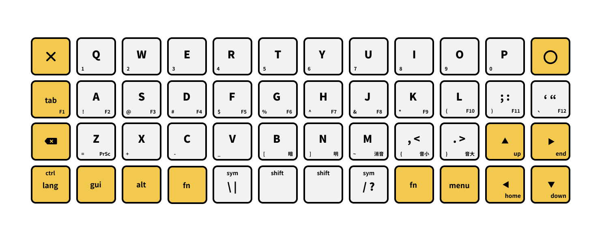
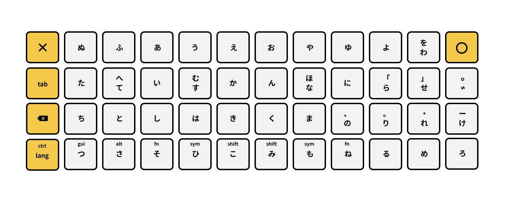

# Windmill
Windmill is a keymap for 40% keyboards.

このキー配列は、40%キーボード向けに作成したものです。

- 風車状のカーソル配置
- かな入力対応 (ほぼJISかな配列)
- SandS (Space and Shift)

詳しくは、以下をどうぞ。

- [キー配列 (↓)](#キー配列)
- [追加機能 (↓)](#追加機能)
- [導入方法](docs/install.md)
- [ファームウェアの作成](docs/build.md)

## 対応キーボード

| メーカー | キーボード | キーマップ |
| --- | --- | --- |
| Boardsource | [Technik](https://boardsource.xyz/store/5ffb9b01edd0447f8023fdb2) | [technik](firmware/technik/) |
| YMD | [YMD40](https://ymdkey.com/collections/40-mini-diy) | [ymd40](firmware/ymd40/) |
| Chosfox X Masro | [Geonix48](https://chosfox.com/ja/products/chosfox-x-masro-geonix48) | [minipeg48](firmware/minipeg48/) |
| Chosfox X Masro | [Geonix Rev.2.5](https://chosfox.com/products/chosfox-x-masro-geonix-rev-2-5) | [geonix41](firmware/geonix41/) |

📦ファームウェアのバイナリは[リリースページ](https://github.com/cognitom/windmill/releases)からダウンロードできます。

## キー配列

### 英字入力時

- ESC(✕)とEnter(○)が対称配置
- BSが最左列
- Fn, Sym, Shiftは、ホールド時に有効

### かな入力時

- 英語配列では修飾キーが並ぶ最下段も含めて、フルに4段を使う
- 「ほ」「へ」「む」「ー」のみシフト側へ
- 「こ」「み」同時押しでスペースキー
- GUI, Alt, Fn, Sym, Shiftは、ホールド時に有効

### 記号とファンクションキー

英字入力、かな入力ともに、最下段中央付近のキーをホールドすると、記号(Sym)またはファンクションキー(Fn)の入力になります。配置については英字配列の図で、各キーの添え字を参照。

かな/英数切り替えは、Ctrlキーのタップで行います。タップするたびに、かなと英数が入れ替わります。IMEへ送るキーはOSごとに異なり、[対象OSの切り替え](#対象osの切り替え)で選びます。

かな入力中に Ctrl, GUI, Alt をホールドしている間は、一時的に英字配列になります。<kbd>Ctrl</kbd>+<kbd>C</kbd> や <kbd>GUI</kbd>+<kbd>V</kbd> といったショートカットが、かなに切り替えなくてもそのまま打てます。

|  | L5 | L4| L3 | L2 | L1 | L0 | R0 | R1 | R2 |
|--|:--:|:--:|:--:|:--:|:--:|:--:|:--:|:--:|:--:|
| ホールド | Ctrl | GUI | Alt | Fn | Sym | Shift | Shift | Sym | Fn |
| タップ (英数) | かなへ | GUI | Alt | | \ | Space | Space | / | |
| タップ (かな) | 英数へ | つ | さ | そ | ひ | こ | み | も | ね |

キーボードはIMEの状態を読み取れないため、切り替えを自分で数えて追いかけています。電源を入れた直後は英数から始まります。マウスなどでIME側だけを切り替えると、かな/英数の配列とIMEがずれます。Windows ではかな/英数を直接指定して送るので、もう一度 Ctrl をタップすれば揃います。Android では日本語IMEと英語IMEそのものを切り替えます (日本語IMEの英数モードは、入力欄を移るたびにかなへ戻ってしまうため)。

ずれてしまったときは、<kbd>Fn</kbd>+<kbd>Ctrl</kbd> でキーボード側はそのままに、IME側だけを切り替えられます。Windows では今の配列に合わせたかな/英数を送り直すので、ずれていなければ何も起きません。Android は切り替えのキーしか送れないため、揃っているときに押すと逆にずれます (もう一度押せば戻ります)。

<kbd>Fn</kbd>+<kbd>Tab</kbd> は Caps Lock です。押すたびにオンとオフが入れ替わります。Android などで意図せず Caps Lock がかかってしまったときは、これで外せます。

### 設定レイヤー

左右の <kbd>Fn</kbd> を両方ホールドしている間は、キーボードの設定用のレイヤーになります。配置は全機種で共通です (キー名は英字配列でのもの)。

| キー | 独自キーコード | 設定 |
|--|--|--|
| <kbd>Fn</kbd>+<kbd>Fn</kbd>+<kbd>A</kbd> | MY_WIN | [対象OS](#対象osの切り替え)を Windows に |
| <kbd>Fn</kbd>+<kbd>Fn</kbd>+<kbd>S</kbd> | MY_ANDR | 対象OSを Android に |
| <kbd>Fn</kbd>+<kbd>Fn</kbd>+<kbd>Z</kbd> | MY_JIS | [接続先のキーボード配列](#キーボード配列の切り替え)を JIS に (既定) |
| <kbd>Fn</kbd>+<kbd>Fn</kbd>+<kbd>X</kbd> | MY_US | 接続先のキーボード配列を US に |
| <kbd>Fn</kbd>+<kbd>Fn</kbd>+<kbd>Enter</kbd> | QK_BOOT | ファームウェアを書き込めるモードへ |
| <kbd>Fn</kbd>+<kbd>Fn</kbd>+<kbd>Esc</kbd> / <kbd>Q</kbd> / <kbd>W</kbd> / <kbd>E</kbd> / <kbd>R</kbd> | MD_USB / MD_BLE1 / MD_BLE2 / MD_BLE3 / MD_24G | 接続先を USB / Bluetooth 1〜3 / 2.4G に (Geonix Rev2.5 のみ) |

対象OSとキーボード配列は、接続先 (USB / Bluetooth 1〜3 / 2.4G) ごとに覚えます。

片方の <kbd>Fn</kbd> を離すと、残したほうでファンクションキーの入力へ戻ります。

## 追加機能

### LED (Technik, YMD40, Geonix Rev2.5 のみ)

選択されたレイヤーが分かりやすいように、文字種別にライティングされます。

なお、デフォルトの状態はLEDが明るいので、暗い部屋で使う場合に光量を落として使えるダークモードを用意しました。使い方は、次の通り。

- <kbd>Fn</kbd> + <kbd>Enter</kbd> を押す

ダークモードを解除するには、もう一度上記のキーを押します。

### 対象OSの切り替え

各OSのIMEの差異を吸収するため、モードを切り替えることができます。キーは[設定レイヤー](#設定レイヤー)にあります。

| 独自キーコード | キー | 対象OS | 配列の認識 | IME | かな/英数切り替えで送るキー |
|--|--|--|--|--|--|
| MY_WIN | <kbd>Fn</kbd>+<kbd>Fn</kbd>+<kbd>A</kbd> | Windows 11 | 日本語 (JIS) / English (US) | Microsof IME | <kbd>かな</kbd> / <kbd>英数</kbd> を交互に (`KC_LNG1` / `KC_LNG2`) |
| MY_ANDR | <kbd>Fn</kbd>+<kbd>Fn</kbd>+<kbd>S</kbd> | Android | 日本語 (JIS) / English (US) | Gboard | <kbd>Ctrl</kbd>+<kbd>Space</kbd> (日本語⇔英語のIMEを切り替え) |

「配列の認識」は、OSがこのキーボードをどの配列として扱っているかです。どちらでも使えますが、キーボードの側にも同じものを[設定](#キーボード配列の切り替え)しておきます。

対象OSが Android のときは、GUI と Alt の扱いも変わります。

- <kbd>GUI</kbd> と <kbd>Alt</kbd> の同時押しは、後から押したほうを送りません。Android はこの組み合わせを Caps Lock の切り替えとして扱うため、かな入力で「つ」「さ」を続けて打つだけで Caps Lock がかかってしまいます
- <kbd>GUI</kbd>+<kbd>.</kbd> は <kbd>Alt</kbd>+<kbd>.</kbd> として送ります。Windows の <kbd>Win</kbd>+<kbd>.</kbd> と同じ操作にするためです

### キーボード配列の切り替え

同じ文字でも、キーボードが送るべきキーは、OSがこのキーボードをどの配列として扱っているかで変わります。たとえば <kbd>@</kbd> は、US 配列なら <kbd>Shift</kbd>+<kbd>2</kbd>、JIS 配列なら単独のキーです。OS側の設定に合わせてキーボード側の配列を選んでおくと、どちらでも同じ文字が出ます。キーは[設定レイヤー](#設定レイヤー)にあります。

| 独自キーコード | キー | OSがキーボードを扱う配列 |
|--|--|--|
| MY_JIS | <kbd>Fn</kbd>+<kbd>Fn</kbd>+<kbd>Z</kbd> | 日本語 (JIS)。既定 |
| MY_US | <kbd>Fn</kbd>+<kbd>Fn</kbd>+<kbd>X</kbd> | English (US) |

対象OSと同じく、接続先ごとに覚えます。記号が刻印どおりに出ないとき (<kbd>@</kbd> を打つと <kbd>"</kbd> や <kbd>[</kbd> になる、など) は、ここがOS側の設定と食い違っています。

配列で送るキーが変わるのは、英字入力時の記号と、かな入力時の「へ」「む」「ー」「ろ」「」です。<kbd>Shift</kbd> を押しながら打った文字が、JIS 配列では単独のキーになっていることがあります (<kbd>:</kbd> など)。そのときは <kbd>Shift</kbd> を一瞬外してから送るので、こうした文字だけは押しっぱなしにしても連続入力されません。

## v3での変更点

前バージョンから4年ほど経つ中で、かなりQMKだけでできることが増えて来ました。Androidが「かな入力」にデフォルトで対応したりと、OS側の動きも大きいです。なので、今回はQMKを`v0.33.11`にした上で、なるべく独自実装を避けてVIALなどでも調整可能な範囲に収めることを主眼に置きました。[CHANGES.md](CHANGES.md)にClaudeが詳しく書いているのでそちらをどうぞ。

- **変更**: かな切り替えをCtrlキーのダブルタップに
- **廃止**: ローマ字エミュレーション
- **廃止**: NumPad

内部実装はかなり変わって簡素になっていますが、使い勝手はそれほど変わらないのではないかと思います。

## ライセンス

Copyright (c) 2021-2026 Tsutomu Kawamura

このリポジトリのソースコードは **GPL-2.0-or-later** (GNU General Public License version 2, または任意のそれ以降のバージョン) で配布しています。全文は [LICENSE](LICENSE) を参照してください。

ビルドしたファームウェアは [QMK Firmware](https://github.com/qmk/qmk_firmware) (GPL-2.0-or-later) を含みます。また、各キーボードの定義ファイル (`keyboard.json` など) は以下をもとにしています。

- `technik`: QMKの [`boardsource/technik_o`](https://github.com/qmk/qmk_firmware/tree/master/keyboards/boardsource/technik_o)
- `ymd40`: QMKの [`ymdk/ymd40/v2`](https://github.com/qmk/qmk_firmware/tree/master/keyboards/ymdk/ymd40) (LEDの数を実機に合わせて変更)
- `minipeg48`: [sporewoh minipeg48](https://github.com/ChrisChrisLoLo/minipeg48) (本家QMKには未収録)
- `geonix41`: ベンダー (RDMCTMZT) 配布のソースをもとに移植 (本家QMKには未収録)

`geonix41` だけは無線・電源・LED制御にベンダー提供のクローズドソースなライブラリ
(`librdrcommon.a`) を使っており、これはこのリポジトリには含まれていません。
ビルド時に `scripts/geonix41/fetch-vendor-blob.py` がベンダー配布物から取得します。
詳しくは [firmware/geonix41/readme.md](firmware/geonix41/readme.md) を参照してください。
