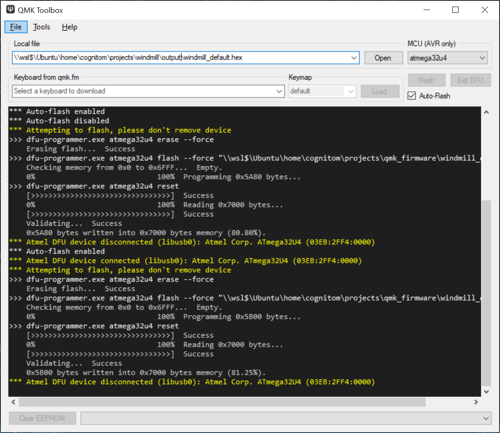

# 導入方法

## 準備

1. 対応キーボードを入手
2. PC/Macに[QMK Toolbox](https://github.com/qmk/qmk_toolbox/releases)をインストール
3. Windmillの[コンパイル済みファームウェア (windmill.hex)](https://github.com/cognitom/windmill/releases) をダウンロード

## ファームウェアの書き込み

### Technik / YMD40

1. QMK Toolboxからファームウェアファイルを指定
2. キーボードを接続
3. <kbd>Fn</kbd> + <kbd>P</kbd>で書き込み可能なモードに ※あるいは、キーボード基板裏のリセットボタンを爪楊枝などで押す
4. `Flash`実行

※なお、Macについては未検証なので、調整が必要かもしれません。

## IMEの設定

キーボードレイアウトは英語(US)に。IMEの入力方式として「かな入力」を選択しておきます。

※以前のバージョンで必要だった、ローマ字変換テーブルの置き換えなどは不要です。
